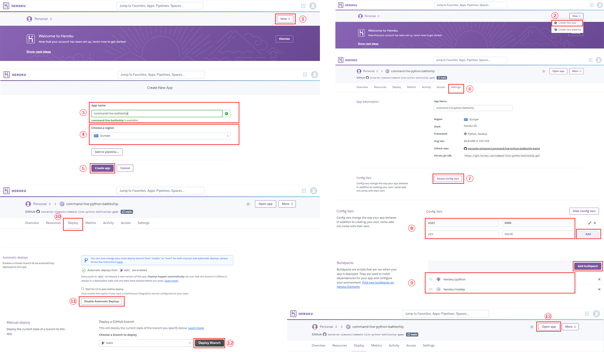

# COMMAND LINE PYTHON BATTLESHIP GAME

Command Line Python Battleship Game, is a python based game that as its name implies, it is played on a command line console. It is inspired in the well-known Battleship board game. This game is intended for users looking for simple and quick online entertaintment. Its logic is straightforward to understand and in the case the user has never played it before, the program offers the option to display the rules which explain the essence of the game.

In this version of the game, the user will play versus the computer. The computer will generate five random battleships and place them in its board comprised of an eight by eight grid which is hidden, the user will have 20 turns (missiles) to try and sink all before running out of turns, they have to choose their missiles coordinates by inputting a row and a column. Should the user sink them all and win or run out of turns and lose, they are offered the option to either end the program or play again.

This game hopes to offer an online option for those battleship board game fans and new players alike, to enjoy the fun of Battleship without the need of an actual board game.


## UX

### Flowchart

In order to design the game logic, I initially created a flowchart with the basic steps that the program needed to take for it to function. To create said flowchart I used [Diagrams.net](https://app.diagrams.net/) which is an online tool useful to build flowcharts among other things.


### Emojis

To improve user experience, I included emojis in the interface, this way the game turns a bit more fun and the user can experience colors and shapes while playing. To source these emojis I used [Emojipedia.org](https://emojipedia.org/)


## Features

### Existing Features

- **Welcome Screen**

    - In this feature the user is greeted and welcomed to the game, also it shows the user what programming language the game is built on and the programmer's credits. Then the user is asked whether they want to see the rules or jump straight into the game by pressing R for rules or G for game.


- **Rules**

    - In the rules feature the user can see/read the rules that explain the works of the game. It is explained to the user how many ships the computer has hidden in the board, how many turns (missiles) the user has to try and sink all the computer's battleships and win, and also how to choose the necesary coordinates to fire their missiles.


- **Gameboard**

    - The gameboard shows the user the board grid initialiy with all spaces in blank indicating the user that no moves have been made yet. In this gameboard is where the game itself will start, develope and end. It will display X's for misses and a battleship for battleships sunk in the corresponding cell.


- **Row and Column User Input Request**

    - The user input request occurs once the user has initiated the game ie. pressed either R for rules or G for game. Here the program asks the user to input the row and column coordinates to the cell in the board where their misille will be fired.


- **User's Duplicate Guess Message**

    - This message indicates the user that the cell to where they are tryin to fire their missile has already been fired upon. Whether it's a previous miss or sunk battleship, the user will get a message saying "you fired a missile to thas coordinate already".


- **Missile Count and Hit or Miss Message**

    - This feature is to give the user a real time update of what's happened after they fired their missile. The message will include whether they hit and sunk a battleship or missed the shot, and how many turns (missiles) they have left.


- **Win or Lose Message and Option to End Program or Play Again**

    - Once the user has either won os lost the game a message will show indicating either case, also the option to end the program or play again will be offered. To be able to show the screenshot of the winning message on the mock console, the number of turns was increased to 64 and then reverted back to 20 for the final version of the game.


### Future Features

There are two additional features that I think would improve the user experience that I would like to add to the project in the future.

- Customizable Grid Size.
    - I would like to add the functionality to the program that would allow the user to choose from at least three grid sizes, 5x5, 8x8 and 10x10.
- Different Battleship Sizes.
    - I want to add the logic to the program that will allow the computer create different size battleships, the user would have a more fun experience when not one but several cells will be destroyed when a battleship is hit.

## Tools & Technologies Used

For this program I used several tools and technologies listed below:

- [Diagrams.net](https://app.diagrams.net/) used for logic design process.
- [Python](https://www.python.org) used as the back-end programming language.
- [Git](https://git-scm.com) used for version control. (`git add`, `git commit`, `git push`)
- [GitHub](https://github.com) used for secure online code storage.
- [Gitpod](https://gitpod.io) used as a cloud-based IDE for development.
- [Markdown Builder by Tim Nelson](https://traveltimn.github.io/readme-builder) used to help generate the Markdown files.
- [Heroku](https://www.heroku.com) used for hosting the deployed back-end site.
- [Adobe Photoshop](https://www.adobe.com/ie/products/photoshop.html): It was used to resize and cut images as well as framing several images together into one.

## Data Model

### Flowchart

To follow best practice, a flowchart was created for the app's logic,
and mapped out before coding began using a free version of
[Diagrams.net](https://app.diagrams.net/).

Below is the flowchart of the main process of this Python program. It shows the entire cycle of the program.


### Classes & Functions

The program uses classes as a blueprint for the project's objects (OOP). This allows for the object to be reusable.

```python
class GameBoard:
    """
    Create an object of an entity board. This class
    will create 2 objects, the user's board and the computer's
    board. It also has methods that will allow to print the user's board
    while keeping the computer's hidden and return the column value to the
    user's input key by using the letters_to_numbers dictionary.
    """

    def __init__(self, board):
        self.board = board

class Battleship:
    """
    Create battleship objects in a board entity. This class
    will create 5 battleships. Via its methods it will add them
    to the hidden computer's board,
    it will get and return the user's inputs for row and column,
    it will handle any user input errors, return the user input
    and count the hit battleships.
    it will also handle the game intro (welcoming), giving the
    user the option to print (see/read) the rules or to start
    the game right away.
    """

    def __init__(self, board):
        self.board = board
```

The primary functions and methods used on this application are:

- `clear()`
    - Clears the screen when necessary to create space for new printouts.
- `convert_letters_to_numbers()`
    - Retrieves the corresponding number to the letter the user will input.
- `print_board(self)`
    - Prints an eight by eight user board grid.
- `create_ships(self)`
    - Creates the five computer's hidden battleships in random positions in the board.
- `get_user_input(self)`
    - Requests and returns the user's inputs for row and column, it also handles errors when user input not in range.
- `intro_to_game(self)`
    -  Requests and returns the user's input to select whether they want to read the rules and start the game or simply start the game, it also handles errors when user input not in range.
- `count_destroyed_ships(self)`
    - Counts how many of the computer's hidden battleships have been hit by the user.
- `print_intro()`
    - Prints the welcome message to the user and offers them the options from intro_to game method.
- `print_rules()`
    - Prints the game rules should the user chooses to do so.
- `play_again_option()`
    - Asks the user once they've finished the game whether they want to play again or end the program.
- `run_game()`
    - Executes the main logic of the game.


### Imports

I've used the following Python packages and/or external imported packages.

- `os`: used for adding a `clear()` function.
- `random`: used to get a random choice from a list.

## Testing

For all testing, please refer to the [TESTING.md](TESTING.md) file.

## Deployment

Code Institute has provided a [template](https://github.com/Code-Institute-Org/python-essentials-template) to display the terminal view of this backend application in a modern web browser.
This is to improve the accessibility of the project to others.

The live deployed application can be found deployed on [Heroku](https://command-line-python-battleship.herokuapp.com).

### Heroku Deployment

This project uses [Heroku](https://www.heroku.com), a platform as a service (PaaS) that enables developers to build, run, and operate applications entirely in the cloud.

Deployment steps are as follows, after account setup:

- Select **New** in the top-right corner of your Heroku Dashboard, and select **Create new app** from the dropdown menu.
- Your app name must be unique, and then choose a region closest to you (EU or USA), and finally, select **Create App**.
- From the new app **Settings**, click **Reveal Config Vars**, and set the value of KEY to `PORT`, and the value to `8000` then select *add*.
- If using any confidential credentials, such as CREDS.JSON, then these should be pasted in the Config Variables as well. No confidential credentials were used for this program hence no CREDS.JSON file was needed.
- Further down, to support dependencies, select **Add Buildpack**.
- The order of the buildpacks is important, select `Python` first, then `Node.js` second. (if they are not in this order, you can drag them to rearrange them)
- On the **Deploy** tab, click on the **Enable Automatic Deploys** to allow dynamic App update after every **GitHub** push. Please note that on the screenshot it shows **Disable Automatic Deploys** because the app had already been deployed when screenshot was taken.
- Further down, to execute the deployment and connect your own GitHub repository to the newly created app, click on **Deploy Branch**
- Finally once Heroku finishes building the App, click on **Open App** to see the App deployed.



Heroku needs two additional files in order to deploy properly.
- requirements.txt
- Procfile

You can install this project's **requirements** (where applicable) using:
- `pip3 install -r requirements.txt` Please note that **requirements** file was left blank for this program since no additional requirements were needed.

If you have your own packages that have been installed, then the requirements file needs updated using:
- `pip3 freeze --local > requirements.txt`

The **Procfile** can be created with the following command:
- `echo web: node index.js > Procfile`

### Local Deployment

This project can be cloned or forked in order to make a local copy on your own system.

For either method, you will need to install any applicable packages found within the *requirements.txt* file.
- `pip3 install -r requirements.txt`.

If using any confidential credentials, such as `CREDS.json` or `env.py` data, these will need to be manually added to your own newly created project as well.

#### Cloning

You can clone the repository by following these steps:

1. Go to the [GitHub repository](https://github.com/leonardo-simeone/command-line-python-battleship-game) 
2. Locate the Code button above the list of files and click it 
3. Select if you prefer to clone using HTTPS, SSH, or GitHub CLI and click the copy button to copy the URL to your clipboard
4. Open Git Bash or Terminal
5. Change the current working directory to the one where you want the cloned directory
6. In your IDE Terminal, type the following command to clone my repository:
	- `git clone https://github.com/leonardo-simeone/command-line-python-battleship-game.git`
7. Press Enter to create your local clone.

Alternatively, if using Gitpod, you can click below to create your own workspace using this repository.

[](https://gitpod.io/#https://github.com/leonardo-simeone/command-line-python-battleship-game)

Please note that in order to directly open the project in Gitpod, you need to have the browser extension installed.
A tutorial on how to do that can be found [here](https://www.gitpod.io/docs/configure/user-settings/browser-extension).

#### Forking

By forking the GitHub Repository, we make a copy of the original repository on our GitHub account to view and/or make changes without affecting the original owner's repository.
You can fork this repository by using the following steps:

1. Log in to GitHub and locate the [GitHub Repository](https://github.com/leonardo-simeone/command-line-python-battleship-game)
2. At the top of the Repository (not top of page) just above the "Settings" Button on the menu, locate the "Fork" Button.
3. Once clicked, you should now have a copy of the original repository in your own GitHub account!

### Local VS Deployment

The local program performance is optimal as well as the deployed version, the only significant difference as stated in the [TESTING.md](TESTING.md) file more specifically in the **Unfixed Bugs** section is that in the local version the screen clears completetly after the `clear()` function is called whereas in the deployed version when you scroll up, a "residue" from the "Rules" print out can seen.

1. `heroku/python`
2. `heroku/nodejs`

You must then create a _Config Var_ called `PORT`. Set this to `8000`

If you have credentials, such as in the Love Sandwiches project, you must create another _Config Var_ called `CREDS` and paste the JSON into the value field.

Connect your GitHub repository and deploy as normal.

## Constraints

The deployment terminal is set to 80 columns by 24 rows. That means that each line of text needs to be 80 characters or less otherwise it will be wrapped onto a second line.

-----
Happy coding!