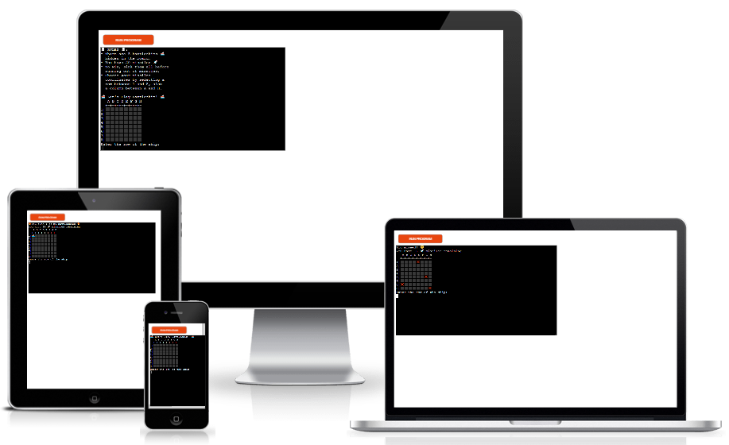
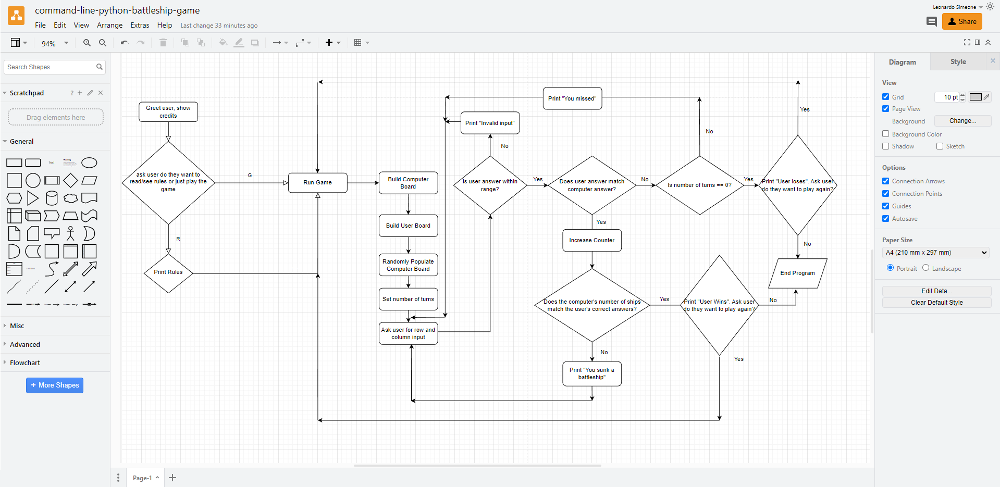
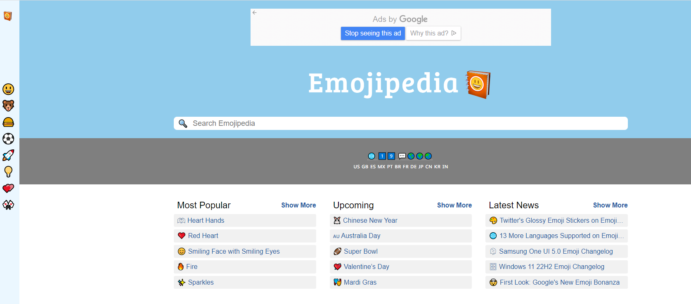
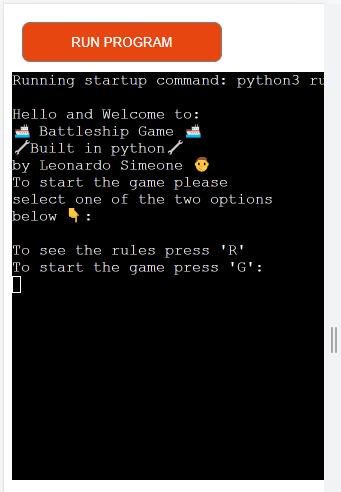
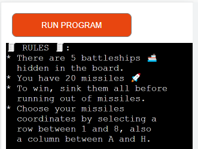
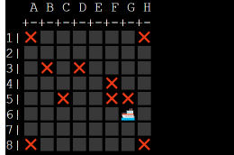
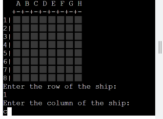
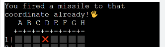
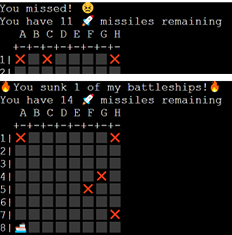
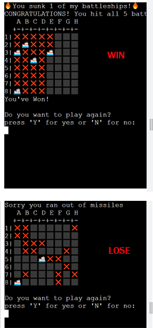

# COMMAND LINE PYTHON BATTLESHIP GAME

Command Line Python Battleship Game, is a python based game that as its name implies, it is played on a command line console. It is inspired in the well-known Battleship board game. This game is intended for users looking for simple and quick online entertaintment. Its logic is straightforward to understand and in the case the user has never played it before, the program offers the option to display the rules which explain the essence of the game.

In this version of the game, the user will play versus the computer. The computer will generate five random battleships and place them in its board comprised of an eight by eight grid which is hidden, the user will have 20 turns (missiles) to try and sink all before running out of turns, they have to choose their missiles coordinates by inputting a row and a column. Should the user sink them all and win or run out of turns and lose, they are offered the option to either end the program or play again.

This game hopes to offer an online option for those battleship board game fans and new players alike, to enjoy the fun of Battleship without the need of an actual board game.

## UX

### Flowchart

In order to design the game logic, I initially created a flowchart with the basic steps that the program needed to take for it to function. To create said flowchart I used [Diagrams.net](https://app.diagrams.net/) which is an online tool useful to build flowcharts among other things.

### Emojis

To improve user experience, I included emojis in the interface, this way the game turns a bit more fun and the user can experience colors and shapes while playing. To source these emojis I used [Emojipedia.org](https://emojipedia.org/)

## Features

### Existing Features

- **Welcome Screen**

    - In this feature the user is greeted and welcomed to the game, also it shows the user what programming language the game is built on and the programmer's credits. Then the user is asked whether they want to see the rules or jump straight into the game by pressing R for rules or G for game.

- **Rules**

    - In the rules feature the user can see/read the rules that explain the works of the game. It is explained to the user how many ships the computer has hidden in the board, how many turns (missiles) the user has to try and sink all the computer's battleships and win, and also how to choose the necesary coordinates to fire their missiles.

- **Gameboard**

    - The gameboard shows the user the board grid initialiy with all spaces in blank indicating the user that no moves have been made yet. In this gameboard is where the game itself will start, develope and end. It will display X's for misses and a battleship for battleships sunk in the corresponding cell.

- **Row and Column User Input Request**

    - The user input request occurs once the user has initiated the game ie. pressed either R for rules or G for game. Here the program asks the user to input the row and column coordinates to the cell in the board where their misille will be fired.

- **User's Duplicate Guess Message**

    - This message indicates the user that the cell to where they are tryin to fire their missile has already been fired upon. Whether it's a previous miss or sunk battleship, the user will get a message saying "you fired a missile to thas coordinate already".

- **Missile Count and Hit or Miss Message**

    - This feature is to give the user a real time update of what's happened after they fired their missile. The message will include whether they hit and sunk a battleship or missed the shot, and how many turns (missiles) they have left.

- **Win or Lose Message and Option to End Program or Play Again**

    - Once the user has either won os lost the game a message will show indicating either case, also the option to end the program or play again will be offered. To be able to show the screenshot of the winning message on the mock console, the number of turns was increased to 64 and then reverted back to 20 for the final version of the game.

### Future Features

There are two additional features that I think would improve the user experience that I would like to add to the project in the future.

- Customizable Grid Size.
    - I would like to add the functionality to the program that would allow the user to choose from at least three grid sizes, 5x5, 8x8 and 10x10.
- Different Battleship Sizes.
    - I want to add the logic to the program that will allow the computer create different size battleships, the user would have a more fun experience when not one but several cells will be destroyed when a battleship is hit.

## Tools & Technologies Used

For this program I used several tools and technologies listed below:

- [Diagrams.net](https://app.diagrams.net/) used for logic design process.
- [Python](https://www.python.org) used as the back-end programming language.
- [Git](https://git-scm.com) used for version control. (`git add`, `git commit`, `git push`)
- [GitHub](https://github.com) used for secure online code storage.
- [Gitpod](https://gitpod.io) used as a cloud-based IDE for development.
- [Markdown Builder by Tim Nelson](https://traveltimn.github.io/readme-builder) used to help generate the Markdown files.
- [Heroku](https://www.heroku.com) used for hosting the deployed back-end site.
- [Adobe Photoshop](https://www.adobe.com/ie/products/photoshop.html): It was used to resize and cut images as well as framing several images together into one.

This is the Code Institute student template for deploying your third portfolio project, the Python command-line project. The last update to this file was: **August 17, 2021**

## Reminders

* Your code must be placed in the `run.py` file
* Your dependencies must be placed in the `requirements.txt` file
* Do not edit any of the other files or your code may not deploy properly

## Creating the Heroku app

When you create the app, you will need to add two buildpacks from the _Settings_ tab. The ordering is as follows:

1. `heroku/python`
2. `heroku/nodejs`

You must then create a _Config Var_ called `PORT`. Set this to `8000`

If you have credentials, such as in the Love Sandwiches project, you must create another _Config Var_ called `CREDS` and paste the JSON into the value field.

Connect your GitHub repository and deploy as normal.

## Constraints

The deployment terminal is set to 80 columns by 24 rows. That means that each line of text needs to be 80 characters or less otherwise it will be wrapped onto a second line.

-----
Happy coding!