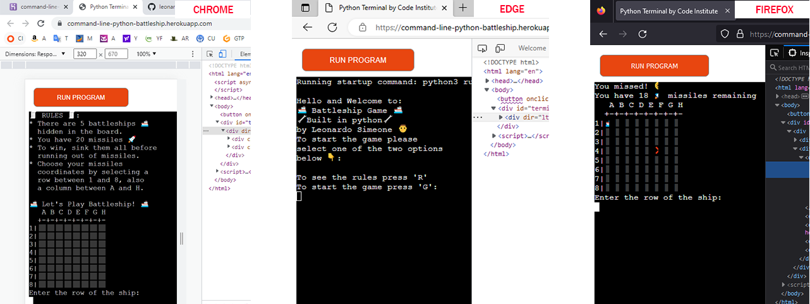

# Testing

Return back to the [README.md](README.md) file.

## Functionality

I manually tested the functionality of the program:

### Intro to Game/Rules and Game or Game

- I made sure that when the program starts, the welcome message is printed and that the user can select to see the rules by pressing R or to start the game and skip the rules by pressing G and in both cases the corresponding screen is printed. Also I tested that whether the user input is not within range or is simply empty, the errors are handled properly. Please see image showing the steps taken for said tests in the same order as described.

### Gameplay and Messages

- I tested the gameplay manually, I made sure that the user inputs work, that the logic to hit a hidden ship works and the appropriate emoji is placed on the board as well as the logic to miss with the right emoji on the board. I tested that the corresponding messages "You sunk 1 of my battleships" for a hit, "sorry you missed" for a miss and "you have X missiles remaining" for the amount of turns remaining were working properly. I also made sure that when the user input for row is not within range, when the user input for column is not within range, when row or column or both are left blank (invalid), all these errors are handled accordingly. Lastly as it can be seen in the last four images, I also tested manually that in the case the user repeats their input coordinates for both a hit and a miss, the corresponding "You fired a missile to that coordinate already" message is printed. Please see image showing the steps taken for said tests in the same order as described.

### Win-Lose and Play Again

- By the time the user gets to finish the game, whether it is by winning it or loosing it, a corresponding message is printed for each case and the option to play again or not (end the program) is given to the user. I manually made sure that these features occur without any issues, including the error handling when the choice between "Y" for play again or "N" for no, I don't want to play again, are out of range or left blank (invalid). Please note that to be able to show the screenshot of the winning message on the mock console, the number of turns was increased to 64 to avoid time comsumption waiting for a win, it was then reverted back to 20 for the final version of the game. Please see image showing the steps taken for said tests in the same order as described.

## Browsers Compatibility

- I tested compatibility and functionality across different browsers. I used Chrome, Edge and Firefox, and in every single one of them the program works and responds well. In spite of the emojis being slightly cut in Firefox, the functionality of the game is still optimal.

## Responsiveness

- I manually tested responsiveness with the help of devtools in Chrome, I checked multiple times that the program responds well regardless of the screen size of the device, I tested that no feauture is affected by screen size change. I tested respponsiveness starting at 320px wide to 1470px wide and beyond.

## Code Validation

### Python

I have used the recommended [CI Python Linter](https://pep8ci.herokuapp.com) to validate all of my Python files.

| File | CI URL | Raw URL | Combined |
| --- | --- | --- | --- |
| PP3 *run.py* file | `https://pep8ci.herokuapp.com/` | `https://raw.githubusercontent.com/leonardo-simeone/command-line-python-battleship-game/main/run.py` | `https://pep8ci.herokuapp.com/https://raw.githubusercontent.com/leonardo-simeone/command-line-python-battleship-game/main/run.py` |

Issues resolved using the CI Python Linter:

| File | CI URL | Screenshot | Notes |
| --- | --- | --- | --- |
| run.py | [CI PEP8](https://pep8ci.herokuapp.com/https://raw.githubusercontent.com/leonardo-simeone/command-line-python-battleship-game/main/run.py) |  | E501 line too long |
| run.py | [CI PEP8](https://pep8ci.herokuapp.com/https://raw.githubusercontent.com/leonardo-simeone/command-line-python-battleship-game/main/run.py) |  | E501 line too long noqa exception |
| run.py | [CI PEP8](https://pep8ci.herokuapp.com/https://raw.githubusercontent.com/leonardo-simeone/command-line-python-battleship-game/main/run.py) |  | W293 blank line contains whitespace |
| run.py | [CI PEP8](https://pep8ci.herokuapp.com/https://raw.githubusercontent.com/leonardo-simeone/command-line-python-battleship-game/main/run.py) |  | W292 no newline at end of file |
